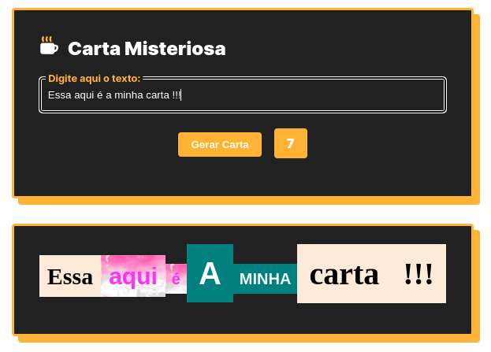

# Boas vindas ao repositório do projeto Carta Misteriosa!

<div align="center">
  
  <div align="left" style="display: inline_block">
    <h2>Módulo: Fundamentos do Desenvolvimento Web</h2>
    <span>
      Este Repositório possuí projeto desenvolvido no período que estive na Trybe, abordando sobre conceitos de estilização, manipulação do DOM com Javascript e reutilização de código.
    </span>
  </div>
  <br>
</div>

## Preview
<div align="left" style="display: inline_block">
  <a href="https://marlondlacerda-mistery-letter.vercel.app/">Clique aqui</a> para ter acesso a um preview do App.
</div>

---

<div align="center">
  
</div>

## HABILIDADES
- Manipular o DOM
- Manipular Javascript
- Manipular o CSS.


## O que foi desenvolvido
- Uma aplicação usando <code>HTML</code>, <code>CSS</code> e <code>JavaScript</code> para gerar cartas misterioras.
---

# Instruções para instalar e rodar os testes de cada requisito
1. Clone o repositório
  * `git clone git@github.com:marlondlacerda/trybe-projetos.git`
  * Entre na pasta do repositório que você acabou de clonar:
    * `cd trybe-projetos/fundamentals/bloco_5/extras/mistery-letter`

2. Instale as dependências e inicialize o projeto
  * Instale as dependências:
    * npm install

3. Entre no Vs Code para verificar os arquivos
  * Atalho no terminal: `code . `
  * A pasta test contém os testes que verifica se as funções estão atendendo o que foi pedido

4. Leia os Requisitos do Projeto logo abaixo explicando o que cada requisito propõem

5. Use o cypress para rodar os tests
  * Atalho no terminal: `npm run cypress:open`

6. **Comente a label carta-texto para que os testes rodem**

***

<details>
    <summary>Requisitos do projeto</summary>

- [x] 1 - Deve haver um `input` com o id=\"carta-texto\" onde a pessoa usuária poderá digitar o conteúdo da carta

- Será validado que existe um elemento `input` com `id=carta-texto`

- [x] 2 - Deve haver um parágrafo com o id=\"carta-gerada\" onde a pessoa usuária verá o resultado de sua carta misteriosa

- Será validado que existe um elemento `p` com o `id="carta-gerada"`

- [x] 3 - Deve haver um botão com id=\"criar-carta\" e ao clicar nesse botão, a carta misteriosa deve ser gerada

  Pontos importantes:

    ``` * Cada palavra deve aparecer dentro de uma tag `span`.
    * As tags `span` devem ser adicionadas como filhas do parágrafo que possui o id `carta-gerada`.```

- Será validado que existe um elemento `button` com `id="criar-carta"`

- Será validado que ao clicar no botão, a carta misteriosa deve ser gerada

- [x] 4 - Ao criar uma carta através do botão com id="criar-carta", o `input` com id="carta-texto" deve permanecer com o texto digitado

- Será validado que ao criar uma carta através do botão `id="criar-carta"` o input` com id=\"carta-texto\" permanece com o texto digitado

- [x] 5 - Se a pessoa usuária não preencher o campo ou preencher com apenas espaços vazios adicionar a mensagem 'Por favor, digite o conteúdo da carta.'

- Será validado que irá exibir a mensagem "Por favor, digite o conteúdo da carta." no elemento `p` com o `id="carta-gerada"

- [x] 6 - Crie a classe `newspaper`

  Pontos importantes:

    * Defina as propriedades:
      - `background-color` com o valor `antiquewhite`
      - `font-family` com o valor `Times New Roman`
      - `font-weight` com o valor `bold`

- Será validado se a classe `newspaper` possui a propriedade `background-color` igual a rgb(250, 235, 215)

- Será validado se a classe `newspaper` possui `font-family` igual a "Times New Roman"

- Será validado se a classe `newspaper` possui a propriedade `font-weight` igual a 700

- [x] 7 - Crie a classe `magazine1`.

  Pontos importantes:

    * Defina as propriedades:
      - `background-color` com o valor `teal`
      - `color` com o valor `white`
      - `font-family` com o valor `Verdana`
      - `font-weight` com o valor `900`
      - `text-transform` com o valor `uppercase`

- Será validado se a classe `magazine1` possui a propriedade `background-color` igual a rgb(0, 128, 128)`

- Será validado se a classe `magazine1` possui  a propriedade `color` igual a rgb(255, 255, 255)`

- Será validado se a classe `magazine1` possui propriedade `font-family` igual a "Verdana"

-  Será validado se a classe `magazine1` possui a propriedade `font-weight` igual a "900"

- Será validado se a classe `magazine1` possui a propriedade `text-transform` igual a "uppercase"`

- [x] 8 - Crie a classe `magazine2`.

  Pontos importantes:

    * Defina as propriedades:
      - `background-image` com a imagem `images/pink-pattern.png`
      - `color` com o valor `fuchsia`
      - `font-family` com o valor `Verdana`
      - `font-weight` com o valor `900`

- Será validado se a classe `magazine2` possui a propriedade `background-image` igual a "images/pink-pattern.png"

- Será validado se a classe `magazine2` possui a propriedade `color` igual a rgb(255, 0, 255)

- Será validado se a classe `magazine2` possui a propriedade `font-family` igual a "Verdana"

- Será validado se a classe `magazine2` possui a propriedade `font-weight` igual a "900"

- [x] 9 - Crie a classe `medium`.

  Pontos importantes:

    * Defina as propriedades:
      - `font-size` com o valor `20px`
      - `padding` com o valor `8px`

- Será validado se a classe `medium` possui a propriedade `font-size` igual a "20px"

- Será validado se a classe `medium` possui a propriedade `padding` igual a "8px"


- [x] 10 - Crie a classe `big`.

  Pontos importantes:

    * Defina as propriedades:
      - `font-size` com o valor `30px`
      - `padding` com o valor `10px`

- Será validado se a classe `big` possui a propriedade `font-size` igual a "30px"

- Será validado se a classe `big` possui a propriedade `padding` igual a "10px"

- [x] 11 - Crie a classe `reallybig`.

  Pontos importantes:

    * Defina as propriedades:
      - `font-size` com o valor `40px`
      - `padding` com o valor `15px`

- Será validado se a classe `reallybig` possui a propriedade `font-size` igual a "40px"

- Será validado se a classe `reallybig` possui a propriedade `padding` igual a "15px"

- [x] 12 - Crie a classe `rotateleft`.

  Pontos importantes:

    * Defina as propriedades:
      - `transform` com o valor `rotate(-5deg)`

- Será validado se a classe `rotateleft` possui a propriedade `transform` igual a "matrix(0.996195, -0.0871557, 0.0871557, 0.996195, 0, 0)"

- [x] 13 - Crie a classe `rotateright`.

  Pontos importantes:

    * Defina as propriedades:
      - `transform` com o valor `rotate(5deg)`

- Será validado se a classe `rotateright` possui a propriedade `transform` igual a "matrix(0.996195, 0.0871557, -0.0871557, 0.996195, 0, 0)"

- [x] 14 - Crie a classe `skewleft`.

  Pontos importantes:

    * Defina as propriedades:
      - `transform` com o valor `skewX(10deg)`;

- Será validado se a classe `skewleft` possui a propriedade `transform` igual a "matrix(1, 0, 0.176327, 1, 0, 0)"

- [x] 15 - Crie a classe `skewright`.

  Pontos importantes:

    * Defina as propriedades:
      - `transform` com o valor `skewX(-10deg)`;

- erá validado se a classe `skewright` possui a propriedade `transform` igual a "matrix(1, 0, -0.176327, 1, 0, 0)"

- [x] 16 - Adicione as classes de forma aleatória a fim de estilizar as palavras.

  Pontos importantes:

    * As classes devem ser adicionadas às tags `span` de forma **aleatória**.
    * Sempre adicione mais de uma classe em uma palavra.
    * Utilize as classes:
      - `newspaper`, `magazine1`, `magazine2` (Grupo estilo)
      - `medium`, `big`, `reallybig` (Grupo tamanho)
      - `rotateleft`, `rotateright` (Grupo rotação)
      - `skewleft`, `skewright` (Grupo inclinação)

      Não é necessário utilizar classes de todos os grupos em uma palavra, mas **não** utilize mais de uma classe do mesmo grupo.
      Ou seja, se você utilizar as classes `magazine1` e `skewright` em uma palavra, as classes `newspaper`, `magazine2`, `skeleft` não devem ser usadas para essa mesma palavra.

- Será validado se ao criar uma carta ela recebe uma lista de classes aleatórias

- Será validado se ao criar uma segunda carta ela recebe uma lista de classes aleatórias

- Será validado se as classes das duas cartas não são exatamente iguais

## BÔNUS:

- [x] 17 - Com uma carta misteriosa gerada, adicione a possibilidade de alterar o estilo de uma palavra específica ao clicar nela

  Pontos importantes:

    * Ao clicar em uma palavra, um novo estilo **aleatório** deve ser aplicado.
    * O número de mudanças deve ser ilimitado;

- Será validado se ao clicar em uma carta uma nova lista aleatória de classes é gerada

- Será validado se ao clicar novamente na mesma carta uma nova lista aleatória de classes é gerada e se a nova lista é diferente da lista anterior

- [x] 18 - Deve haver um parágrafo com o id=\"carta-contador\" onde existirá um contador de palavras

  Pontos importantes:

    * Esse contador deve informar a quantidade de palavras presentes na carta misteriosa gerada.
  
- Será validado que existe um elemento `p` com o `id="carta-contador"`

- Será validado se ao criar uma carta o elemento `p` com o `id="carta-contador"  é atualizado com o número de palavras da carta (valor numérico).

</details>

---

<div align="left">
  <a href="https://github.com/marlondlacerda/trybe-projetos">Voltar para o repositório principal</a>
</div>
<div align="center">

  [⬆ Voltar para o topo](#boas-vindas-ao-repositório-do-projeto-carta-misteriosa)

</div>